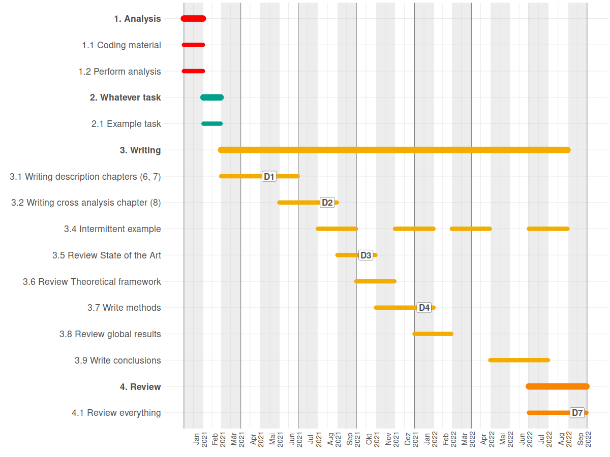

# Simple monthly Gantt

A simple R snippet for getting a monthly gantt chart from simple tasks and milestones in csv format, using the wonderful [Ganttrify](https://github.com/giocomai/ganttrify) package developed by [Giorgio Comai](https://github.com/giocomai).

## Output

See walkthrough [here](https://thessaly.github.io/gantt), but take in consideration this is not an interactive notebook, it's just the html output. You can find `Gantt.Rmd` in the docs folder, download it and open it in RStudio for an interactive version.



## Input format

Input is divided in two csv files: `tasks.csv` and `spots.csv`

### Tasks
`tasks.csv` has four columns: 

```
wp,activity,start_date,end_date
1.Analysis,1.1 Finish coding,1,1
2. Missing data,2.1 Detect missing data,2,2
2. Missing data,2.2 Protocols for missing data collection,2,2
```

- `wp` is the main block that comprises different tasks, its length is calculated by adding the duration of inner tasks, should have a number
- `activity` should have a numbered 1.1, 1.2 etc scheme, you can number many activities with the same prefix if you want one activity to be performed in one line but with interruptions 
- `start_date` and `end_date` are integers representing months, you have to input the actual project start date in the code

### Milestones

`spots.csv` has three columns: 

```
activity,spot_type,spot_date
3.5 Review State of the Art,D3,10
3.7 Write methods,D4,13
```

- `activity` indicates where your milestone will be applied, has to be equal to the text of any `activity` you have in `tasks.csv`
- `spot_type` has the text that will go in the milestone label
- `spot_date` is an integer indicating the month where the label will appear


